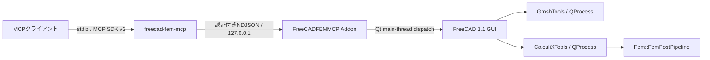

# アーキテクチャ

## 構成

MCPプロセスはFreeCADモジュールを直接importしません。AddonだけがFreeCAD/PySide APIへアクセスし、すべてのFreeCAD操作をGUIメインスレッドへ直列化します。

## コンポーネント

### MCPサーバー

`src/freecad_fem_mcp`は次を担当します。

- 23個の固定MCPツール
- Pydanticによる厳格な入力スキーマ
- MCP tool annotation
- 接続レコードの検証
- localhost NDJSONクライアント
- stdioを汚染しないエラー正規化

公開ツールは内部ブリッジの固定method/actionへ変換されます。クライアントがactionやブリッジmethodを自由に指定することはできません。

### FreeCAD Addon

`addon/FreeCADFEMMCP`は次を担当します。

- FreeCAD 1.1.3以上のバージョンゲート
- 起動ごとの認証トークンと接続レコード
- bounded NDJSONプロトコル
- Qtメインスレッドディスパッチ
- GUI選択と画像取得
- FreeCADネイティブFEMオブジェクトの生成
- Gmsh / CalculiXジョブ管理
- `Fem::FemPostPipeline`の結果照会・表示

### ジョブ

`create_mesh`は`femmesh.gmshtools.GmshTools`を、`start_analysis`は`femsolver.calculix.calculixtools.CalculiXTools`を使用します。AddonからGmshやCalculiXを生のコマンドとして起動しません。

ジョブ状態はAddonに保持されるため、MCPプロセスが再起動してもFreeCADが生きていれば再照会できます。CalculiXの完了時はFreeCAD内部の結果importが終わった次のQtイベントでcompletedへ遷移します。

## FreeCADオブジェクト

線形静解析、固有振動、線形座屈では次のネイティブオブジェクトを使用します。

- `Fem::FemAnalysis`
- `Fem::SolverCalculiX`
- `Fem::FemMeshGmsh`
- `Fem::MaterialSolid`
- FreeCAD標準Constraint群（`Fem::ConstraintRigidBody`、selfweight、centrifugalを含む）
- `Fem::ConstraintPython` Tieと`Fem::ConstraintContact`
- `Fem::FemPostPipeline`

静的回帰チェックにより、`Fem::SolverCcxTools`、`makeSolverCalculiXCcxTools`、`femtools.ccxtools`の導入を禁止します。

## 拡張方針

公開ツールの追加ではなく、既存ツールの判別共用体を段階的に広げます。

1. 非線形・塑性・contact/tie
2. 熱伝導・熱構造連成
3. 電磁・静電、1D/2D要素

FreeCAD 1.1 GUIと新Solverが表現できないCalculiX機能を、任意INPで迂回して追加することはしません。
