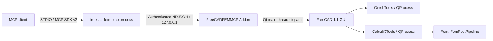

# Architecture

[Back to README](../../README.md)

## System layout

The external MCP process never imports FreeCAD modules. Only the Addon accesses FreeCAD and PySide APIs, and every document operation is serialized onto the GUI main thread.

## MCP server

`src/freecad_fem_mcp` provides:

- the fixed MCP tools listed in the public server contract;
- strict Pydantic input models and closed schemas;
- MCP side-effect annotations;
- connection-record validation;
- an authenticated loopback NDJSON client;
- protocol-safe error normalization without writing diagnostics to STDOUT.

Each public tool maps to a fixed internal bridge method/action pair. A client cannot choose an arbitrary bridge method or inject an action discriminator.

## FreeCAD Addon

`addon/FreeCADFEMMCP` provides:

- the FreeCAD `>=1.1.3,<1.2` version gate;
- a per-launch authentication token and connection record;
- bounded NDJSON framing and dispatch;
- Qt main-thread execution;
- GUI selection, view control, and image capture;
- native FEM object construction;
- Gmsh and CalculiX job management;
- native result inspection and display.

The Addon has no third-party runtime dependencies beyond the Python, PySide, and FEM modules shipped with FreeCAD.

## Connection lifecycle

At FreeCAD startup, the Addon binds only to `127.0.0.1`, selects a loopback port, generates a random token, and writes a bounded connection record under the current user's LocalAppData. The MCP server reads and validates that record when it starts.

If FreeCAD restarts, the bridge client may reload the record once after a transport failure and reconnect to the new PID, port, and token. Multiple simultaneous FreeCAD processes are therefore discouraged: the last process to publish a record becomes the MCP target.

## Native FEM objects

The supported path uses native FreeCAD 1.1 objects, including:

- `Fem::FemAnalysis`;
- `Fem::SolverCalculiX`;
- `Fem::FemMeshGmsh`;
- `Fem::MaterialSolid` and bounded nonlinear material objects;
- native constraint, load, rigid-body, tie, contact, and transform objects;
- `ElementGeometry1D`, `ElementRotation1D`, and `ElementGeometry2D`;
- `Fem::FemPostPipeline` and native mechanical result objects.

Static checks prohibit reintroducing `Fem::SolverCcxTools`, `makeSolverCalculiXCcxTools`, or `femtools.ccxtools`.

## Jobs

`create_mesh` uses FreeCAD's `femmesh.gmshtools.GmshTools`. `start_analysis` uses `femsolver.calculix.calculixtools.CalculiXTools`. The Addon does not assemble arbitrary executable commands.

Job state lives in the Addon, so an MCP process restart does not discard jobs while the FreeCAD GUI remains alive. CalculiX moves to `completed` only after the native result import finishes on a subsequent Qt event.

## Result path

Static results are read from native pipeline frames. Frequency and buckling results are selected by engineering mode number; the MCP absorbs the native frame/block offset difference, including the buckling preload block. Beam and shell output reports both source dimensionality and whether FreeCAD expanded the displayed result to 3D.

## Extension policy

New capabilities should extend typed discriminated variants and native-object mappings. They must not introduce arbitrary Python, shell execution, INP injection, unrestricted property access, or fallback to the legacy solver path. A capability is public only when the FreeCAD object, writer, solver, importer, GUI display, validation, and security contracts can be tested end to end.
